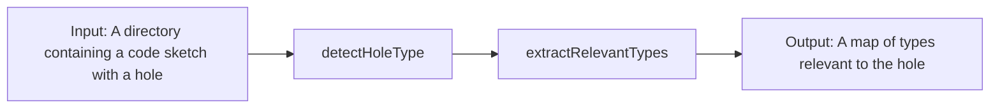

# testtslspclient

A project that aims to run `typescript-language-server` outside the scope of an editor.

## Installation

Install the following dependencies:

```
npm install -g typescript-language-server typescript
```

Clone the `ts-lsp-client` repo:

```
https://github.com/jpoly1219/ts-lsp-client
```

... and run these commands:
```
cd ts-lsp-client
npm install
git checkout -b completion
git pull origin completion
```

Clone this `testtslspclient` repo:
```
https://github.com/jpoly1219/testtslspclient
```

... and run these commands inside the repo root:
```
cd testtslspclient
npm install
```

## Running the code

Run the following command to start the program:
```
node app.mjs
```

## Diagram

This is a top-level view of how data flows throughout the program.


We first try to see where the hole is located at. Then we detect the type of the hole.
Once we find the type of the hole, we use that to extract relevant types by recursively walking the type definitions in the given directory.
